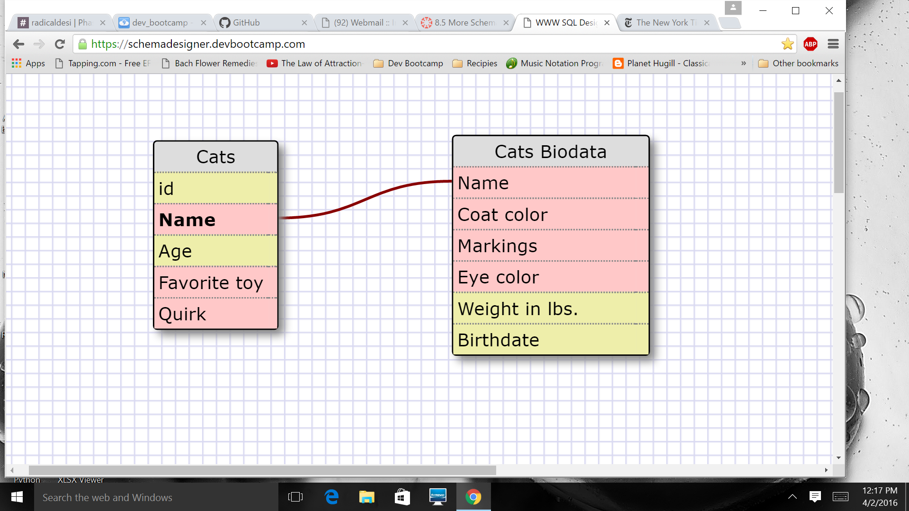
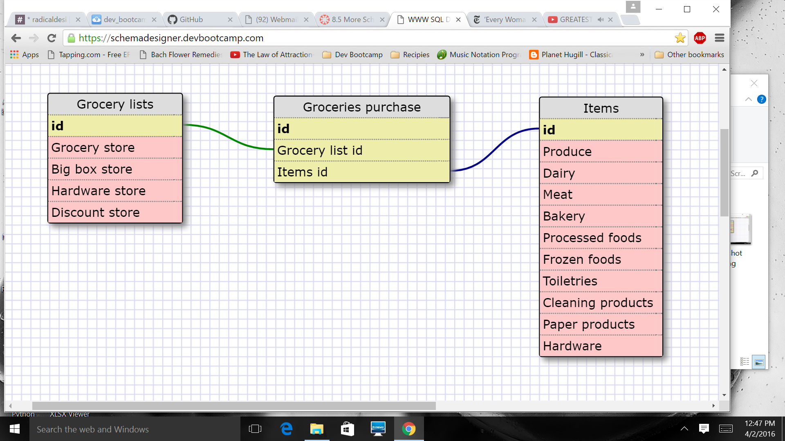

Below I created two tables, each of which represent info about one cat.  The primary
table, Cats, is used to store helpful info for cat sitters, so they are prepared to 
cater to their preferences.  The Cats Biodata table is connected by the cat's name, 
but stores additional info regarding each cat's appearance, weight and birthdate.  
These two tables show a one-to-one relationship.

What is a one-to-one database?

It is a relationship between two database tables, in which both tables have 
different information on the same item and are linked using keys.

When would you use a one-to-one database? (Think generally, not in terms of 
the example you created).

I would use a one-to-one database when I needed some information on an item regularly, 
but not all of the information available for that item.  By creating a separate table with 
the less-frequently needed info, I could save database resources by using only the main
table and accessing the other table only as needed. 

What is a many-to-many database?

It is a relationship between two database tables, in which both tables contain information
on multiple items and are connected by a join table.

When would you use a many-to-many database? (Think generally, not in terms of the example you created).

I would use a many-to-many database when creating tables about multiple items that are related
and useful information could be derived by joining them together.

What is confusing about database schemas? What makes sense?

The concepts seem clear, but putting them into practice will most likely be challenging!

